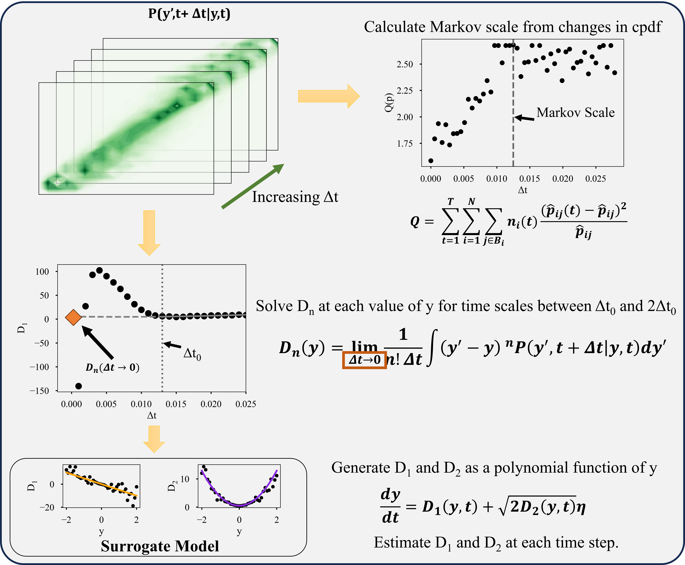
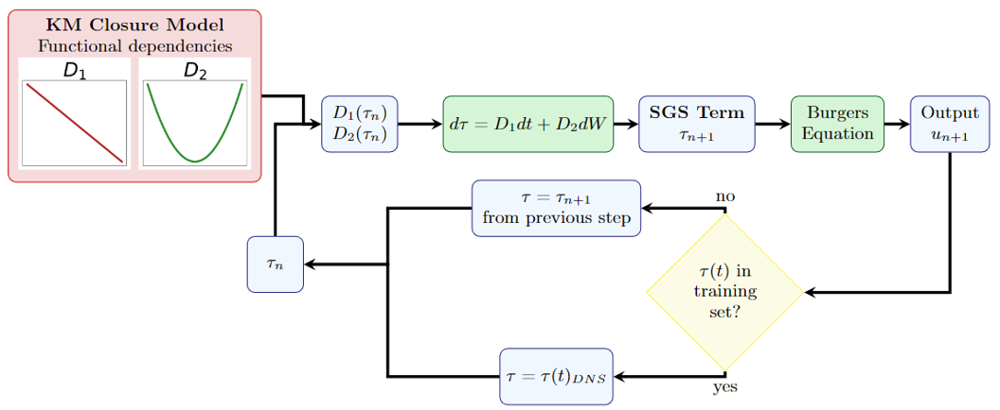

[![Citation][citation-shield]][citation-url]
[![Commit][commit-shield]][commit-url]
[![Stars][star-shield]][star-url]
[![Issues][issues-shield]][issues-url]
[![GNU GPL-3.0 License][license-shield]][license-url]

# Kramers-Moyal Subgrid-scale Closure

This repository contains code to provide a data-driven closure for the subgrid scale term in Large Eddy Simulation (LES) of the momentum equation using the Kramers-Moyal expansion method. The current code is implemented as a subgrid scale closure in the 1D Burgers equation (Burger's turbulence). All relevant code can be found in the Code folder.

<!-- TABLE OF CONTENTS -->
# Table of Contents

<ol>
    <li>
      <a href="#about-the-project">About the Project</a>
        <ul>
          <li><a href="#stochastic-burgers-equation">Stochastic Burgers Equation</a></li>
          <li><a href="#kramers-moyal-expansion-method">Kramers-Moyal Expansion Method</a></li>
          <li><a href="#km-implementation-for-sgs-closure">KM Implementation for SGS Closure</a></li>
      </ul>
    </li>
    <li>
        <a href="#using-the-code">Using the Code</a>
            <ul>
                <li><a href="#code-dependencies">Code Dependencies</a></li>
                <li><a href="#files-included">Files Included</a></li>
                <li><a href="#important-variables">Important Variables</a></li>
                <li><a href="#example-usage">Example Usage</a></li>
                <li><a href="#roadmap">Roadmap</a></li>
            </ul>
    </li>
    <li><a href="#contribute">Contribute</a></li>
    <li><a href="#license">License</a></li>
    <li><a href="#citation">Citation</a></li>
</ol>

<!--ABOUT THE PROJECT-->
# About the Project
This repository is intended to provide a data-driven subgrid-scale closure method using the principles of statistical mechanics. The current SGS closure is implemented into an LES closure for the stochastically forced 1D momentum equation (Burgers equation). The following sections provide more information on the stochastic Burgers equation, Kramers-Moyal (KM) expansion method, and the implementation of the KM method for closure of the SGS term in LES of the Burgers equation.

See the [the cited paper](https://www.researchgate.net/profile/Hitesh-Bindra/publication/376766325_Development_of_a_subgrid-scale_model_for_Burgers_turbulence_using_statistical_mechanics-based_methods/links/65999ab53c472d2e8eb968a9/Development-of-a-subgrid-scale-model-for-Burgers-turbulence-using-statistical-mechanics-based-methods.pdf) for a more thorough derivation of the math involved.

<p align="right">(<a href="#readme-top">back to top</a>)</p>

<!--STOCHASTIC BURGERS EQUATION-->
## Stochastic Burgers Equation

This code is built off of [Jeremy Gibbs' pyBurgers repository](https://github.com/jeremygibbs/pyBurgers). A more detailed description of the numerical method for solving the stochastic Burgers equation for both DNS and LES can be found there.

The general form of the 1D momentum equation (Burgers equation) can be written as 

$$\frac{\partial u}{\partial t}+u\frac{\partial u}{\partial x} = \nu \frac{\partial^2 u}{\partial x^2}+f(x,t)$$

In the case of the stochastic Burgers equation, the forcing function is defined as a noise term that is white in time and colored in space by

$$\langle\widehat{f}(k,t)\widehat{f}(k',t')\rangle = 2C_0|k|^{\beta}\delta (k+k')\delta (t-t')$$

The Burgers equation can be solved numerically using direct numerical simulation (DNS) with sufficient spatial elements. To reduce the number of spatial elements required, an additional subgrid-scale (SGS) term is added to account for the interactions below the grid scale. This is called large eddy simulation (LES). The equation for solving Burgers equation using LES is defined by

$$\frac{\partial \bar{u}}{\partial t}+\bar{u}\frac{\partial \bar{u}}{\partial x} = \nu \frac{\partial^2\bar{u}}{\partial x^2} + \bar{f}(x,t)-\frac{1}{2}\frac{\partial \tau}{\partial x}$$

The objective of this code is to generate a model for $\tau$ in the SGS term.

<p align="right">(<a href="#readme-top">back to top</a>)</p>

<!--KRAMERS-MOYAL EXPANSION METHOD-->
## Kramers-Moyal Expansion Method

The Kramers-Moyal (KM) expansion method is a statistical mechanics-based method for describing the evolution of a pdf in time.

KM coefficients are defined from the probabilistic moments by

$$D_n(y) = \lim_{\Delta t\to 0}\frac{1}{n!\Delta t}\int_{-\infty}^{\infty}(y(t+\Delta t)-y)^nP(y(t+\Delta t),t+\Delta t|y(t),t)dy$$

These KM coefficients can be implemented into a Fokker-Planck equation to describe the probability evolution over time

$$\frac{\partial p}{\partial t} = \sum_{n=1}^{\infty} \frac{\partial^n}{\partial y^n}D_n(y,t)p(y,t)$$

The corresponding equation for some state variable, $y$, is given by

$$\frac{dt}{dy}=D_1(y,t)+\sqrt{D_2(y,t)}dW$$

where $dW$ is a normally distributed random variable with mean equal to 0 and a standard deviation of 1.

To calculate the KM coefficients from a discrete time series, the data is binned and the conditional probability (cPDF) of the time series going from one bin to another is estimated after some time step $\Delta t$. To find the value of $D_1$ or $D_2$ as $\Delta t \to 0$, the values of $D_1$ or $D_2$ are calculated for varying values of $\Delta t$. The extrapolation function is fit to a $\Delta t$ range between one and two times the Markov scale with a resolution equal to that of the time resolution of the data.

<div align="center">
    
</div>

<p align="right">(<a href="#readme-top">back to top</a>)</p>

<!--KM IMPLEMENTATION FOR SGS CLOSURE-->
## KM Implementation for SGS Closure

The value for the subgrid-scale (SGS) term, $\tau$, can be calculated from the resultant DNS solution.

$$\tau = \overline{uu} - \bar{u}\bar{u}$$

The values for the KM coefficients, $D_1$ and $D_2$, can be calculated from time series of $\tau$ calculated from DNS using the method in the previous section.

The value for $\tau$ can be found on the fly by solving the SDE numerically using the Euler-Marayuma method.

$$\tau_{n+1} = \tau_n + D_1(\tau_n)dt
    + D_2(\tau_n)dW_n+\frac{1}{2}(D_2D_2')(\tau_n)(dW_n^2-dt)$$

If the value of $\tau$ is available from the training data, that $\tau$ is used to calibrate the SGS term. If $\tau$ is not available, then it is calculated off of previous values of $\tau$ using the equation above.


<div align="center">
    
</div>


<p align="right">(<a href="#readme-top">back to top</a>)</p>

<!--USING THE CODE-->
# Using the Code

This code is written in Python 3 and is compatible with Windows, Linux, and Mac operating systems. It has been tested by running in Anaconda powershell prompt in Anaconda 3.0 and Spyder 4.0 on Windows, Spyder 3.0 on Mac, and Linux command line.

Currently the code is not available as a package and must be run from the downloaded Python files.

<p align="right">(<a href="#readme-top">back to top</a>)</p>

<!--DEPENDENCIES-->
## Code Dependencies

Required libraries include numpy, scipy, scikit.sklearn, and netCDF4. To install, run the following in the terminal

```
pip install scikit.sklearn
```

and

```
pip install netCDF4
```

<p align="right">(<a href="#readme-top">back to top</a>)</p>

<!--FILES INCLUDED-->
## Files Included

There are currently 5 files in the Code folder of this repository. Three are copied directly from [Jeremy Gibbs' pyBurgers repository](https://github.com/jeremygibbs/pyBurgers) to reduce the number of downloads. These files are indicated with a :hamburger: next to their name.

**KM_utils.py** - Functions used for the KM model.

**burgers.py**:hamburger: - Functions used for numerical solutions of the Burgers equation.

**namelist.json**:hamburger: - Parameters for solving the Burgers equation.

**burgers_DNS.py**:hamburger: - Solves Burgers equation using DNS.

**burgers_LESKMfromDNS.py** - Solves Burgers equation using LES with the KM-based closure.

<p align="right">(<a href="#readme-top">back to top</a>)</p>

<!--IMPORTANT VARIABLES-->
## Important Variables

**nx** - Number of spatial grid elements for DNS solution

**dt** - Time step of simulation

**nt** - Number of time steps to solve in the simulation

**visc** - Viscosity ($\nu$)

**damp** - Damping coefficient ($D_0$)

**nxLES** - Number of spatial grid elements for LES solution

**dns_fname** - File name for the DNS training data (Currently pyBurgersDNS.nc)

**dt_DNS** - Time step for outputted DNS velocity

<p align="right">(<a href="#readme-top">back to top</a>)</p>

<!--EXAMPLE USAGE-->
## Example Usage

Run the DNS script to obtain the training data.

```
python burgersDNS.py
```

This will generate a netCDF file. The current file name is **pyBurgersDNS.nc**, but this can be changed in line 51 of burgersDNS.py before running.

Run the LES script to train from the data provided in the DNS data and then implement that as a closure for LES.

```
python burgers_LESfromDNS.py
```

The LES will output another netCDF file. The current file name is **pyBurgersLES_KMfromDNS.nc**. This can be changed in line 120 of burgers_LESfromDNS.py before running.

<p align="right">(<a href="#readme-top">back to top</a>)</p>

<!-- ROADMAP -->
## Roadmap

The development of this code is still a work in progress. This code has 

- [x] Implement KM surrogate for $\tau$ time series
- [x] Estimate Markov scale from time series statistics 
- [x] Implement KM closure for solving LES in 1D momentum equation (Burgers equation)
- [ ] Publish distribution package
- [ ] Phase out NetCDF4 requirement
- [ ] Implement KM into other closures

See the [open issues](https://github.com/mcr11996/KramersMoyalSGSClosure/issues) for a full list of proposed features and known issues.

<p align="right">(<a href="#readme-top">back to top</a>)</p>

<!-- LICENSE -->
# License

Distributed under the GNU GPL-3.0 License. See `LICENSE.txt` for more information.

<p align="right">(<a href="#readme-top">back to top</a>)</p>

<!-- CONTRIBUTE -->
# Contribute

Contributions to this repository are always welcome. Any contributions you make are **greatly appreciated**.

If you have a suggestion that would make this project better, please fork the repo and create a pull request. You can also simply open an issue with the tag "enhancement".

1. Fork the Project
2. Create your Feature Branch (`git checkout -b feature/AmazingFeature`)
3. Commit your Changes (`git commit -m 'Add some AmazingFeature'`)
4. Push to the Branch (`git push origin feature/AmazingFeature`)
5. Open a Pull Request

<p align="right">(<a href="#readme-top">back to top</a>)</p>

<!--CITATION-->
# Citation

If using this repository, please cite

Ross, Molly, and Hitesh Bindra. "Development of a subgrid-scale model for Burgers turbulence using statistical mechanics-based methods." Physics of Fluids 35.12 (2023).

```
@article{ross2023development,
  title={Development of a subgrid-scale model for Burgers turbulence using statistical mechanics-based methods},
  author={Ross, Molly and Bindra, Hitesh},
  journal={Physics of Fluids},
  volume={35},
  number={12},
  year={2023},
  publisher={AIP Publishing}
}
```
<p align="right">(<a href="#readme-top">back to top</a>)</p>

[contributors-shield]: https://img.shields.io/github/contributors/mcr11996/KramersMoyalBurgulenceClosure?style=for-the-badge
[contributors-url]: https://github.com/mcr11996/KramersMoyalSGSClosure/graphs/contributors
[forks-shield]: https://img.shields.io/github/forks/mcr11996/KramersMoyalBurgulenceClosure?style=for-the-badge
[forks-url]: https://github.com/mcr11996/KramersMoyalBurgulenceClosure/network/members
[star-shield]: https://img.shields.io/github/stars/mcr11996/KramersMoyalSGSClosure?style=for-the-badge
[star-url]: https://github.com/mcr11996/KramersMoyalSGSClosure
[commit-shield]: https://img.shields.io/github/last-commit/mcr11996/KramersMoyalSGSClosure?style=for-the-badge
[commit-url]: https://github.com/mcr11996/KramersMoyalSGSClosure
[issues-shield]: https://img.shields.io/github/issues/mcr11996/KramersMoyalSGSClosure?style=for-the-badge&color=red
[issues-url]: https://github.com/mcr11996/KramersMoyalSGSClosure/issues
[license-shield]: https://img.shields.io/badge/GPL-3?style=for-the-badge&label=LICENSE&color=green
[license-url]: https://github.com/mcr11996/KramersMoyalSGS/blob/master/LICENSE.txt
[citation-shield]: https://img.shields.io/badge/PUBLICATION-3?style=for-the-badge&logo=googlescholar&labelColor=grey&color=grey
[citation-url]: https://pubs.aip.org/aip/pof/article/35/12/125144/2930728
[linkedin-shield]: https://img.shields.io/badge/-LinkedIn-black.svg?style=for-the-badge&logo=linkedin&colorB=555
[linkedin-url]: https://linkedin.com/in/molly-ross-48300186/
[top-shield]: https://img.shields.io/badge/back%20to%20top-3?style=for-the-badge&color=blue
[product-screenshot]: images/screenshot.png
[Next.js]: https://img.shields.io/badge/next.js-000000?style=for-the-badge&logo=nextdotjs&logoColor=white
[Next-url]: https://nextjs.org/
[React.js]: https://img.shields.io/badge/React-20232A?style=for-the-badge&logo=react&logoColor=61DAFB
[React-url]: https://reactjs.org/
[Vue.js]: https://img.shields.io/badge/Vue.js-35495E?style=for-the-badge&logo=vuedotjs&logoColor=4FC08D
[Vue-url]: https://vuejs.org/
[Angular.io]: https://img.shields.io/badge/Angular-DD0031?style=for-the-badge&logo=angular&logoColor=white
[Angular-url]: https://angular.io/
[Svelte.dev]: https://img.shields.io/badge/Svelte-4A4A55?style=for-the-badge&logo=svelte&logoColor=FF3E00
[Svelte-url]: https://svelte.dev/
[Laravel.com]: https://img.shields.io/badge/Laravel-FF2D20?style=for-the-badge&logo=laravel&logoColor=white
[Laravel-url]: https://laravel.com
[Bootstrap.com]: https://img.shields.io/badge/Bootstrap-563D7C?style=for-the-badge&logo=bootstrap&logoColor=white
[Bootstrap-url]: https://getbootstrap.com
[JQuery.com]: https://img.shields.io/badge/jQuery-0769AD?style=for-the-badge&logo=jquery&logoColor=white
[JQuery-url]: https://jquery.com 


